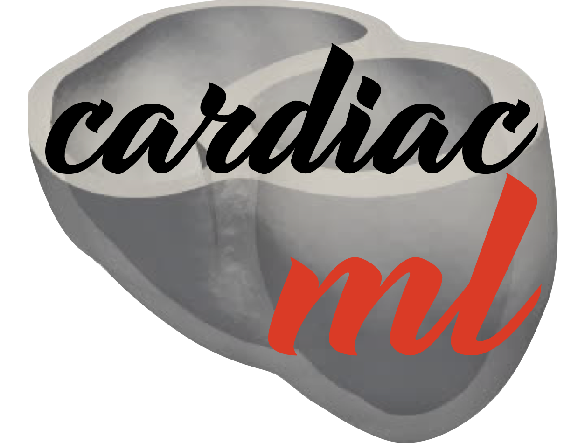
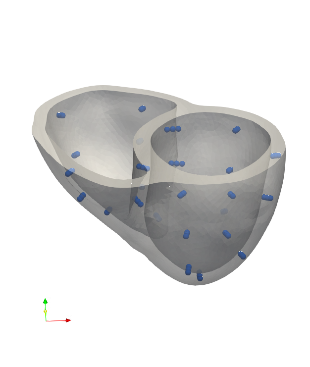

<!-- #  Machine Learning for Cardiac Electrical Imaging (cardiac_ml) -->

#  Machine Learning for Cardiac Electrical Imaging

Welcome to the GitHub repository for machine learning in cardiac electrical imaging! This repository contains code specifically tailored for the research paper and dataset described below:

- **(Paper)** M. Landajuela, R. Anirudh, J. Loscazo, and R. Blake, "Intracardiac Electrical Imaging Using the 12-Lead ECG: A Machine Learning Approach Using Synthetic Data," presented at the 2022 Computing in Cardiology (CinC) conference in Tampere, Finland. The paper can be accessed [here](https://ieeexplore.ieee.org/stamp/stamp.jsp?tp=&arnumber=10081783). It is published in the proceedings of CinC 2022, pages 1-4. The DOI for this paper is [10.22489/CinC.2022.026](https://doi.org/10.22489/CinC.2022.026).

- **(Dataset)** M. Landajuela, R. Anirudh, and R. Blake have curated a comprehensive dataset of simulated intracardiac transmembrane voltage recordings and ECG signals. This dataset is part of the Lawrence Livermore National Laboratory (LLNL) Open Data Initiative and can be accessed [here](https://doi.org/10.6075/J0SN094N). The dataset was published in the UC San Diego Library Digital Collections in 2022.

- **(Blog Post)** M. Landajuela, Machine Learning for Cardiac Electrocardiography [here](https://medium.com/@mikel.landajuela.larma/machine-learning-for-cardiac-electrocardiography-a20661669937).

The code in this repository supports two primary tasks:

1. Activation Map Reconstruction from ECG
2. Transmembrane Potential Reconstruction from ECG

Feel free to explore the code and utilize it for your own research or projects related to cardiac electrical imaging.


<p align="center">
    
</p>

## Overview

### Installation
To install the code, you can use the following commands:
```bash
python3 -m venv venv
source venv/bin/activate
pip install -r requirements.txt
```

### Code Structure

The main code is in the following files:
| File | Description |
| --- | --- |
| [`trainable_model.py`](./cardiac_ml/trainable_model.py)| Base class for all the models |
| [`io_util.py`](./cardiac_ml/io_util.py) | Utility functions for input/output |
| [`ml_util.py`](./cardiac_ml/ml_util.py) | Utility functions for machine learning |
| [`data_interface.py`](./cardiac_ml/data_interface.py) | Interface to the data |
| [`learn_ecg2time.py`](./learn_ecg2time.py) | Main code for task 1 |
| [`learn_ecg2vm.py`](./learn_ecg2vm.py) | Main code for task 2 |

### Configuration files

Configuration files can be found in `config/ecg2*.config`.
For example, the configuration file for `ecg2time` is [`ecg2time.config`](./config/ecg2time.config).
The configuration files contain the following sections: 

| Section | Description |
| --- | --- |
| `[DATA]` | Data related parameters |
| `[MODEL]` | Model related parameters |
| `[TRAIN]` | Training related parameters |
| `[SAVE]` | Logging related parameters |

### Run
To run the code, you can use the following commands:
```bash
python3 learn_ecg2time.py config/ecg2time.config
python3 learn_ecg2vm.py config/ecg2vm.config
```
**Note**: You can create an input deck directory for the training `ecg2*_input_deck` 
and run the code from the input deck directory.
```bash
python3 ../learn_ecg2time.py ../config/ecg2time.config
python3 ../learn_ecg2vm.py ../config/ecg2vm.config
```
### Post-process
To post-process the results, you can use the following commands:
``` bash
python3 ./tools/read_training_stats.py trainingStats_errors.h5 -plot True
```

### Visualization

We provide a typical heart mesh and the corresponding recording locations in the `geometry` folder. 
The mesh is in the `.vtk` format and the recording locations are in the `.csv` format.
You can visualize the mesh and the recording locations using [ParaView](https://www.paraview.org/).
Note that the recording locations are in the same coordinate system as the mesh.
Also, the indices of the recorded transmembrane potentials correspond to the indices of the recording locations.
One way to interpolate the predicted values at the recording locations to the whole cardiac mesh is to use the `ShepardKernel` filter in ParaView.

<p align="center">
    
</p>

## Data
The data associated with this code is provided in the following repository:
[Dataset of Simulated Intracardiac Transmembrane Voltage Recordings and ECG Signals](https://library.ucsd.edu/dc/object/bb29449106).

<details><summary>Steps to download the dataset (<strong>Click to expand</strong>)</summary>

To download the data, you can use the following command:
```bash
source download_intracardiac_dataset.sh
```

Once, it is downloaded, you can point to the data using the `datapaths_train` and `datapaths_val` in the configuration file.
For example, the configuration file for `ecg2time` looks like:
```txt
[DATA]
datapaths_train = [full path of intracardiac_dataset]/data_hearts_dd_0p2
datapaths_val = [full path of intracardiac_dataset]/data_hearts_dd_0p2
```
**Note**: You might want to change the train and validation data path to point to your split of the data.

</details>


## License

`cardiac_ml` is distributed under the terms of the MIT license.

All new contributions must be made under the MIT license.

See [LICENSE](./LICENSE),
and
[NOTICE](./NOTICE) for details.

LLNL-CODE-850741


